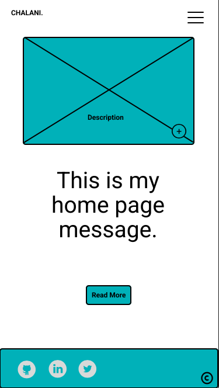
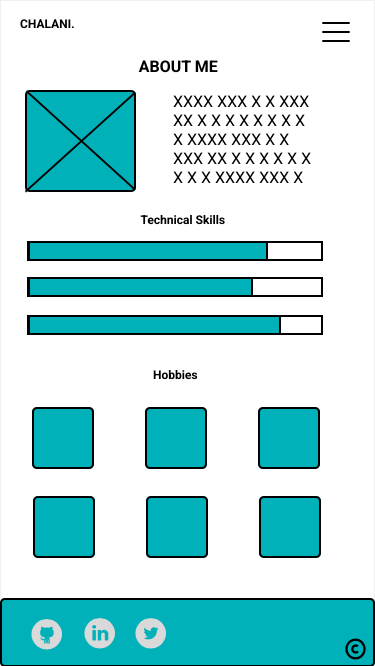
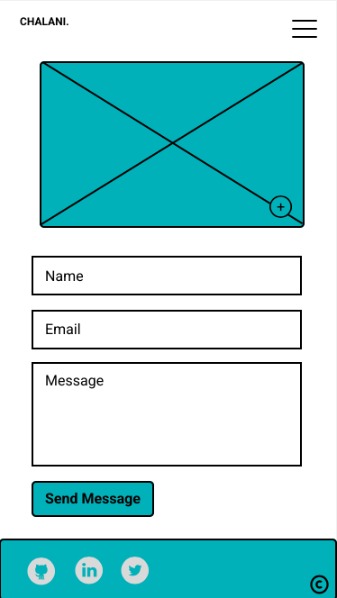

https://chalanidissanayaka.github.io/ChalaniDissanayaka-T1A2-Portfolio/src/index.html

# Personal Portfolio Project- Chalani Dissanayaka

The objectives of the Personal Portfolio Project is demonstrate my css and html abilities to prospective employers.

## Authors

Chalani Dissanayaka

# Developement Process and Documentation

## Ideas

I appreciate simplicity. Therefore my first thoughts were designing a very simple layout with light colors.

## Designing the Personal Portfolio

- I start with mobile version of the personal portfolio and selected iphone 13 view on Figma tool.

- Then i came up with the following design for mobile version.

### Home page



### About page



### Project page


### Contact page



## Developing the Personal Portfolio

### Development ideas.

#### Page Layout.

- Header (navbar with chalani logo and social icons)
- Main section
- Sidebar (Blogs)
- Footer

#### structure (CSS-grid)

```
.about-section {
  grid-area: about-section;
}
.sidebar {
  grid-area: sidebar;
}
.project-gallery {
    grid-area: project-gallery;
}
.contact-me {
    grid-area: contact-me;
}

/* Main Grid using Template Areas */

.container {
  display: grid;
  grid-template-columns: 100%;
  grid-template-rows: auto;
  grid-template-areas:
    "about-section"
    "project-gallery"
    "sidebar"
    "contact-me";
}

```

- The above layout for mobile view. I started with the mobile view.

## Development phase.

#### stage one.

##### Home page.

- I started with the Home page, index.html, style.css and added it to git. I was able to complete the first stage of Home page.
- First i completed navbar and logo.
- Then i completed footer.
- Next step was working on my project gallery.
- After that i started working on blogs aside.
- Finally i added news section into end of the bolgs aside.
- Then I did a test on Google Chrome Browser Mobile view. The structure was clean and it looked great.

##### About page.

##### Project page.

##### Contact page.
