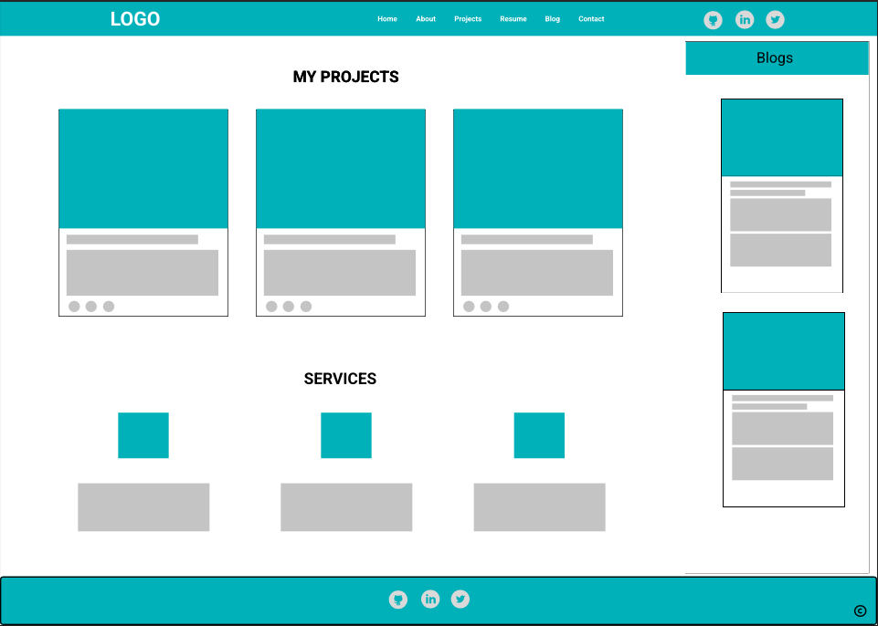
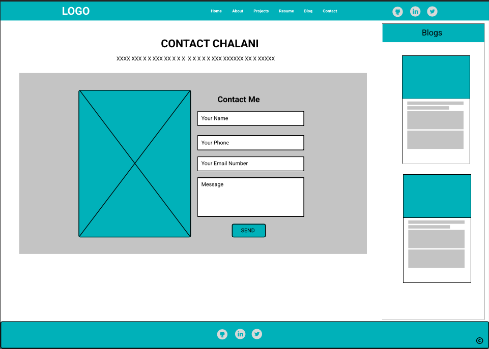

## Portfolio Project- Chalani Dissanayaka - (Coder Academy Term 1 Assignment 2)

### LINKS

- [Published Portfolio Wbsite](https://chalanidissanayaka.github.io/ChalaniDissanayaka-T1A2-Portfolio/src/index.html)

- [GitHub Repo](https://github.com/ChalaniDissanayaka/ChalaniDissanayaka-T1A2-Portfolio)

- [Presentation Video](https://youtu.be/_F8ibBmWR24)

## Authors

Chalani Dissanayaka

### PURPOSE

The purpose of creating this portfolio website is to showcase my proficiency in CSS
and HTML . Through meticulously crafted web pages, I aim to exhibit my ability to design
visually appealing and user-friendly interfaces. By presenting a diverse range of projects
and demonstrating my skills in front-end development, I seek to convey my competence and
expertise to prospective employers. This portfolio serves as a platform to highlight my
creativity, attention to detail, and capability to deliver high-quality web solutions.
Ultimately, my goal is to impress employers and secure opportunities to contribute effectively
as a front-end developer in the industry.

### TARGET AUDIENCE

As a junior full-stack developer, the primary target audience for my 4-page portfolio website
encompasses prospective employers, recruiters, fellow developers, and potential clients. With a
focus on showcasing my burgeoning talent, the website aims to highlight my technical skills,
problem-solving abilities, and creative prowess. Through intuitive navigation and engaging
design, visitors will gain insights into my coding capabilities, project portfolio, and
proficiency across various technologies. By crafting a visually appealing and user-friendly
interface, I seek to leave a lasting impression on visitors, demonstrating my readiness to
contribute to dynamic development teams and tackle diverse challenges in the tech industry.

### SITE MAP


#### Home page

- Home Page
  - Nav Links
    - Link to all other pages
    - About Page
    - Project Page
    - Contact Page
  - Nav Link Social Icons
    - Links to social media and GitHub
  - Introduction Section
    - Read More button
      - Links to Project Page
  - Project Gallery Section
    - Clickable Image Links
      - Links to Project Page
  - Blogs Section
  - News Section
  - Contact Form
  - Footer Links
    - Links to all other pages
    - About Page
    - Project Page
    - Contact Page

#### About page

- About Page
  - Navbar Hyperlinks
    - Links to all other pages
    - Home Page
    - Project Page
    - Contact Page
  - Navbar Clickable Social Icons
    - Links to social media and GitHub
  - About me Section
    - Hire Me button
      - Links to my resume
  - Technical Skills Section
  - My Hobbies Section
    - social icons
      - Links to socia media
  - Blogs Section
  - Footer Links
    - Links to all other pages
    - Home Page
    - Project Page
    - Contact Page

#### Projects page

- Projects Page
  - Navbar Hyperlinks
    - Links to all other pages
    - Home Page
    - About Page
    - Contact Page
  - Navbar Clickable Social Icons
    - Links to social media and GitHub
  - Project Section
    - Source code links
      - Links to my GitHub
  - Services Section
  - Blogs Section
  - Footer Links
    - Links to all other pages
    - Home Page
    - About Page
    - Contact Page

#### Contact page

- Contact Page
  - Navbar Hyperlinks
    - Links to all other pages
    - Home Page
    - About Page
    - Projects Page
  - Navbar Clickable Social Icons
    - Links to social media and GitHub
  - Contact Information Paragraph links
    - Link to Gmail and Instagram account
  - Contact Form
  - Blogs Section
  - Footer Links
    - Links to all other pages
    - Home Page
    - About Page
    - Projects Page

### COLOR SELECTION

For my website, I've opted for a color palette inspired by the serene hues of the sea and the
tranquil shades of the sky. Drawing from nature's beauty, I integrate earthy tones that evoke
a sense of calmness and harmony. This color selection aims to create a visually appealing and
soothing browsing experience for audience.


I created color palette as a variable in my root of css file. I mostly used lighter color for  
design my website background and darker color for footer, headings and paragraphs.

#### My Lighter colors

—clr-primary-2 : #0A6C75 : Atoll

—clr-primary-2 : #2CAEBA : Scooter

—clr-primary-7 : #D1EAED : Jagged Ice

—clr-primary-11 : #EBFAF6 : Polar

—clr-primary-11 : #C7F0F0 : Iceberg

#### My Darker colors

—clr-grey-1 : #102A42 : Elephant

—clr-grey-2 : #102A42 : Cloud Burst

—clr-grey-5 : #102A42 : Lynch

—clr-grey-10 : #102A42 : Catskill White

### FONT SELECTION

Early in the planning phase, i had couple of fonts in my mind but i have changed the mind to folowing font to style my project.

- Lato

## FUNCTIONALITY & FEATURES

This 4-page portfolio website features comprehensive functionality and user-friendly navigation.
The navigation bar and footer provide links to all pages and my social media accounts, ensuring
seamless accessibility. The About page showcases detailed information about myself and my skills,
while the Projects page highlights my portfolio with links to my GitHub account. Additionally,
the Contact page includes a link to my email for easy communication. With its organized structure
and integrated features, this website effectively presents my professional profile and facilitates.

## Developement Process and Documentation

### Ideas

I appreciate simplicity. Therefore my first thoughts were designing a very simple layout with light colors.

### Designing the Personal Portfolio

### Wireframe - Mobile version

- I initiated the development process by focusing on the mobile version of the personal portfolio. Utilizing the Figma tool, I opted for the iPhone 13 view to ensure optimal design alignment.

- Then I devised the design for the mobile version as follows.

### Home page


### About page


### Project page


### Contact page


## Designing the Personal Portfolio

### Wireframe - Desktop version

- My next step was draw the wireframe diagrams for Desktop screen size.

- Initially, I planned to allocate blogs and my resume to a separate HTML page. After thorough analysis and careful research, I opted to integrate blogs into a sidebar for a more cohesive user experience. I attached my resume link to the hire me button in about page.

### Home page


### About page


### Project page



### Contact page



## Developing the Personal Portfolio

### Development ideas.

- Initially, I planned to allocate blogs and my resume to a separate HTML page. I attached my resume link to the hire me button in about page.

In the initial wireframe v1 design of my portfolio, I intended to place the blog within a
separate HTML page. However, after thorough research and consideration, I opted to
incorporate the blog as a fixed-size sidebar (300px) on all pages. During the development
process, I initially utilized flexbox layout for the sidebar but encountered difficulties
in managing the layout with multiple flexboxes. Subsequently, I transitioned to a grid
layout for both mobile and desktop views to address these challenges effectively.

#### Page Layout for Mobile view.

- Header (navbar with chalani logo and social icons)
- Main section
- Sidebar (Blogs)
- Footer

#### structure (CSS-grid)

#### Home page

```
.about-section {
  grid-area: about-section;
}
.sidebar {
  grid-area: sidebar;
}
.project-gallery {
    grid-area: project-gallery;
}
.contact-me {
    grid-area: contact-me;
}

/* Main Grid using Template Areas */

.container {
  display: grid;
  grid-template-columns: 100%;
  grid-template-rows: auto;
  grid-template-areas:
    "about-section"
    "project-gallery"
    "sidebar"
    "contact-me";
}

```

- The above layout related to the mobile view, which was the initial focus of my first development process.

#### Page Layout for Desktop view.

#### Project page

```
.my-project {
    grid-area: my-projects;
}

.web-services {
    grid-area: web-services;
}

.sidebar {
    grid-area: sidebar;
}

/*
  =====================
  Grid for Desktop View
  =====================
  */

  @media (min-width: 900px) {
    .container {
      grid-template-columns: 1fr 300px;
      grid-template-areas:
        "my-projects sidebar"
        "web-services sidebar";
    }
  }

```


- The above layout pertains to the desktop view, which was the initial focus of my second development process.

## Development phase.

### Stage one - Mobile development.

##### Home page.

- I commenced the development phase with the Home page, crafting the index.html
  and style.css files and integrating them into Git.
- This initial stage laid the foundation for the Home page's structure.
- Afterward, I prioritized the creation of the navbar, incorporating a
  dropdown menu and logo.
- Then I focused on crafting the footer, which features navigation links to
  all pages, social icons, and a copyright paragraph.
- Moving forward, attention was directed towards the about me section and the
  projects gallery.
- Subsequent steps involved developing the blogs section, followed by the addition
  of a news section.
- Finally, I conducted testing on Google Chrome Browser's Mobile view, ensuring
  a clean and visually appealing layout.

##### About page.

- I initiated the development phase for the About page.
- Ensuring consistency, I maintained the navbar, footer, and sidebar across all pages.
- I focused on the main section, which includes details about me, technical skills, and hobbies.
- Each hobby is represented as a reusable card component, designed with a 3D layout.
- Finally, I conducted a mobile view test on Google Chrome Browser.

##### Project page.

- Following the completion of the About page, I transitioned to developing the Project page.
- In this page navbar, footer, and sidebar are consistent across pages.
- This section showcases my projects and services.
- Each my projects card and services represented as reusable card components.
- Upon completion, I conducted a mobile view test on Google Chrome Browser to ensure optimal display.

##### Contact page.

- Continuing with the development process, I moved on to the Contact page.
- To keep things consistent, I made sure the navbar, footer, and sidebar remained the
  same on every page.
- The Contact page features a simple yet effective Contact Form complemented by a
  background image.
- The emphasis was on simplicity and ease of navigation for seamless user interaction.

### Stage two - Desktop development.

##### Home page.

- For the desktop view, I structured the navbar into three columns, incorporating the
  logo, navigation links, and social media icons.
- Footer which features navigation links to
  all pages, social icons, and a copyright paragraph.
- I implemented a media query for larger screens, adjusting the layout accordingly.
- The introduction section was arranged into a two-column layout, as was the projects
  gallery.
- Blogs were positioned in the right sidebar.
- The contact-me section adopted a two-column layout.

##### About page.

- Ensuring consistency, I maintained the navbar, footer, and sidebar across all pages.
- In the second development phase for the desktop view, I structured the About Me section
  into a two-column layout, along with Technical Skills and Hobbies.
- The Hobbies section was further refined into a three-column layout to accommodate
  additional screen size increases.

##### Project page.

- During the second development phase for the desktop view of the projects page,

- To keep things consistent, I made sure the navbar, footer, and sidebar remained the same on every page.
- I structured the My Projects section into a two-column layout, which was later
  expanded to a three-column layout to accommodate additional screen size increases.
- Similarly, the Services section was also organized into a three-column layout for improved presentation.

##### Contact page.

- During the second development phase for the desktop view of the contact page,
  I maintained consistency by ensuring that the navbar, footer, and sidebar remained unchanged across all pages.
- Additionally, I integrated a side image into the contact form, which is designed to
  gradually appear as the screen size increases, enhancing the visual appeal of the page.


- During the testing phase of my portfolio, I encountered an error after pushing my code to GitHub. To resolve the issue, I utilized Chrome Developer Tools to pinpoint the source of the problem. After identifying the issue, I implemented necessary fixes to ensure seamless functionality and optimal performance of the portfolio website.

### Flexbox Utilisation


#### Home Page

- Flexbox - nav-center

  - Flex items - nav-header ,nav-links ,nav-icons

- Flexbox - gallery-center

  - Flex items - gallery-img-container

- Flexbox - contact-center

  - Flex items - contact-title

- Flexbox - contact-form

  - Flex items - form-control, btn-submit

- Flexbox - footer-links, footer-icons

#### About Page

- Flexbox - about-center
- Flexbox - hobby-center

  - Flex items - hobby-container

- Flexbox - hobby-card

  - Flex items - hobby-logo, hobby-glass

#### Projects Page

- Flexbox - project-center

  - Flex items - project-card

- Flexbox - services-center

  - Flex items - service

### THECHNICAL STACK

- HTML5
- CSS3
- Git
- GitHub
- Vs code
- Google Chrome
- Vs code Preview server
- Mozilla Firefox
- Figma
- Canva

### Development Methodology

- Agile Development Methodology

### Further Development

In this portfolio project, I aim to implement smooth-scrolling functionality for the
sidebar blogs. This feature enhances user experience by enabling seamless navigation
through the content, improving accessibility and overall engagement with the portfolio
website.

For further enhancement, I aim to develop a robust contact form API utilizing a MongoDB database. This enhancement will enable users to submit messages through the form, which will then be securely stored in our MongoDB database. This approach ensures efficient management and retrieval of user messages, enhancing the overall functionality and reliability of our contact form system.

#### Useful Links

##### For Colors

https://htmlcolors.com/hsl-to-hex
https://chir.ag/projects/name-that-color
https://www.shutterstock.com/search/ocean-colour-palette
https://coolors.co

##### For Images

https://pixabay.com/photos
https://www.pexels.com/photo
https://www.postermywall.com
https://www.canva.com

##### For Sitemap and Flowchart

https://www.figma.com

##### For Flex and Grid Layouts

https://www.w3schools.com
https://stackoverflow.com

Book : New Perspectives HTML5 and CSS3

## Lot of Thanks

- Lot of thanks Alex and all the friends in the class.
- It was challenging but with all the help and guidance, made my first css project is a succesful one.
